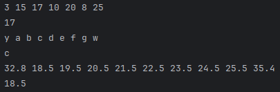
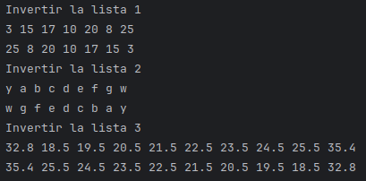

# Doubly Linked List

## Participantes

- **Montoya Solórzano, Leonardo Alfredo**
- **Guerrero Cueva, José Ernesto**
- **Sulca Infante, Esteban Jose**

## Indice
1. [`estructura`](#estructura)
2. [`metodos`](#metodos)

   &nbsp;&nbsp;&nbsp;&nbsp;2.1. [`front`](#front)

   &nbsp;&nbsp;&nbsp;&nbsp;2.2. [`back`](#back)  
   
   &nbsp;&nbsp;&nbsp;&nbsp;2.3. [`push_front`](#push_front)  

   &nbsp;&nbsp;&nbsp;&nbsp;2.4. [`push_back`](#push_back)  
   
   &nbsp;&nbsp;&nbsp;&nbsp;2.5. [`pop_front`](#pop_front)  
   
   &nbsp;&nbsp;&nbsp;&nbsp;2.6. [`pop_back`](#pop_back)

   &nbsp;&nbsp;&nbsp;&nbsp;2.7. [`insert`](#insert)

   &nbsp;&nbsp;&nbsp;&nbsp;2.8. [`remove`](#remove)

   &nbsp;&nbsp;&nbsp;&nbsp;2.9. [`operator[]`](#operator)  
   
   &nbsp;&nbsp;&nbsp;&nbsp;2.10. [`empty`](#empty)  
   
   &nbsp;&nbsp;&nbsp;&nbsp;2.11. [`getSize`](#getSize)  
   
   &nbsp;&nbsp;&nbsp;&nbsp;2.12. [`clear`](#clear)  
   
   &nbsp;&nbsp;&nbsp;&nbsp;2.13. [`reverse`](#reverse)

## 1. `estructura` <a name="estructura"></a>

Los archivos que conforman esta estructura de datos son las siguientes:

- **Node.h:** Contiene una estructura que conforma el nodo (valor y el nodo siguiente), para que desde la clase pueda acceder a sus atributos.
- **Node.tpp:** Contiene la estructura de todos los métodos del struct node.

Como pueden ver en la imagen de abajo, se define la estructura del nodo con los atributos de valor y los punteros nex y prev que caracterizan al doubly linked list.

<p style="text-align:center"></p>

- **DoublyLinkedLists.h:** Incluye la estructura del nodo creado en **Node.h** y con eso conforma clase de la lista, la cual cuenta con un atributo que apunta al primer nodo de la lista (head) además de la cabecera de todos los métodos.
- **DoublyLinkedLists.tpp:** Contiene las estructura de todos los métodos de la lista.

Como se puede ver en la iamgen de abajo, se define la clase de la lista con los atributos de head y tail que caracterizan al doubly linked list, además de 2 constructores en el caso de crear un objeto de la con un valor pasado por parámetro y otro en el caso que no se pase un valor. También la inclusión de un destructor que reutiliza la función clear.

<p style="text-align:center"></p>

- **main.cpp:** Contiene los test de cada método.

## 2. `metodos` <a name="front"></a>

Aprovechando que se está trabajando con templates, se establecen 3 listas con tipos de datos diferentes (int, char y double), como se puede ver en la imagen de abajo, sobre estas listas pasaran a realizar los test.

<p style="text-align:center"></p>

### 2.1. `front` <a name="front"></a>
#### Objetivo:
Retornar el elemento del comienzo

#### Lenguaje de alto nivel
1. Se retorna el primer elemento que ya se tiene apuntando de la lista.

#### Explicacion del codigo
1. Se hace un return al head, el cual marca el primer nodo de la lista.

```c++
return head->val;
```

#### Pruebas

##### Codigos de test
```c++
cout << list1.front() << endl;
cout << list2.front() << endl;
cout << list3.front() << endl;
```

##### Resultados de test

<p style="text-align:center"></p>

### 2.2. `back` <a name="back"></a>
#### Objetivo:
Retornar el elemento al final

#### Lenguaje de alto nivel
1. Se retorna el último elemento que ya se tiene apuntando de la lista.

#### Explicacion del codigo
1. Se hace un return al tail, el cual marca el último nodo de la lista.

```c++
return tail->val;
```

#### Pruebas

##### Codigos de test
```c++
cout << list1.back() << endl;
cout << list2.back() << endl;
cout << list3.back() << endl;
```

##### Resultados de test

<p style="text-align:center"></p>

### 2.3. `push_front` <a name="push_front"></a>
#### Objetivo:
Agregar elemento al comienzo

#### Lenguaje de alto nivel
1. Se crea un nodo con el valor que ese quiere insertar.
2. En caso este vacio se actualiza el head y tail.
3. En caso contrario se hace que el prev del head apunte al nuevo nodo y el next del nuevo nodo apunte al head.
4. Se hace que el head apunte al nuevo nodo.

#### Explicacion del codigo
1. Se crea de forma dinamica un nuevo nodo con el valor dado.

```c++
auto *newNode = new Node<T>(val);
```

2. En caso el head apunte a nullptr (está vacío), el head y tail apuntan al nuevo nodo.

```c++
if(empty()) {
    head = newNode;
    tail = newNode;
}
```

3. En un caso normal el prev del head apunta al nuevo nodo y el next del nuevo apunta al head, finalmente el head apunta al nuevo nodo.

```c++
else {
        head->prev = newNode;
        newNode->next = head;
        head = newNode;
    }
```

#### Pruebas

##### Codigos de test
```c++
list1.push_front(3);
list1.push_front(1);
list2.push_front('y');
list2.push_front('x');
list3.push_front(32.8);
list3.push_front(10.2);
```

##### Resultados de test

<p style="text-align:center"></p>

### 2.4. `push_back` <a name="push_back"></a>
#### Objetivo:
Agregar elemento al final

#### Lenguaje de alto nivel
1. Se crea un nodo con el valor que ese quiere insertar.
2. En caso este vacio se actualiza el head y tail.
3. En caso contrario se hace que el next del tail apunte al nuevo nodo y el prev del nuevo nodo apunte al tail.
4. Se hace que el tail apunte al nuevo nodo.

#### Explicacion del codigo
1. Crea dinámicamente un nuevo nodo (newNode) con el valor proporcionado. Este nodo será agregado a la lista.

```c++
auto *newNode = new Node<T>(value);
```

2. En caso el head apunte a nullptr (está vacío), el head y tail apuntan al nuevo nodo.

```c++
if(empty()) {
        head = newNode;
        tail = newNode;
    }
```

3. En un caso normal el next del tail apunta al nuevo nodo y el prev del nuevo nodo apunta al tail, finalmente el tail apunta al nuevo nodo.

```c++
else {
        tail->next = newNode;
        newNode->prev = tail;
        tail = newNode;
    }
```

#### Pruebas

##### Codigos de test
```c++
list1.push_back(5);
list1.push_back(6);
list2.push_back('e');
list2.push_back('f');
list3.push_back(15.4);
list3.push_back(27.8);
```

##### Resultados de test

<p style="text-align:center"></p>

### 2.5. `pop_front` <a name="pop_front"></a>
#### Objetivo:
Remueve el elemento al comienzo

#### Lenguaje de alto nivel
1. Si está vacío, debe decir que no hay contenido en la lista.
2. Se crea dinámicamente un nodo que almacene el valor del primer nodo.
3. En caso de que solo haya un nodo en la lista se hace que head y tail apunten a nullptr.
4. Se actualiza la cabeza de la lista para que apunte al segundo nodo y se hace que el prev del segundo nodo apunte a nullptr.
5. Se elimina el nodo original (el anterior **head**) liberando su memoria.
6. Se retorna el valor que estaba almacenado en el nodo eliminado.

#### Explicacion del codigo
1. Si esta vacio, se establece como fuera de rango.

```c++
if(empty()){
        throw std::out_of_range("Lista vacia");
    }
```

2. Se crea un puntero **newNode** que apunta al primer nodo y conservamos el valor que contiene.

```c++
Node<T> *newNode = head;
auto val = head->val;
```

3. Si sólo hay un nodo en la lista se hace que el head y tail apunten a nullptr.

```c++
if(head == tail){
        head = nullptr;
        tail = nullptr;
    }
```

4. Se actualiza la cabeza de la lista para que apunte al segundo nodo y se hace que el prev del segundo nodo apunte a nullptr.

```c++
else{
     head = head->next;
     head->prev = nullptr;
}
```

5. Se elimina el nodo original (el anterior **head**) liberando su memoria.

```c++
delete newNode;
```

6. Se retorna el valor que estaba almacenado en el nodo eliminado.

```c++
return val;
```

#### Pruebas

##### Codigos de test
```c++
list1.show();
cout << list1.pop_front() << endl;
list1.show();

list2.show();
cout << list2.pop_front() << endl;
list2.show();

list3.show();
cout << list3.pop_front() << endl;
list3.show();
```

##### Resultados de test

<p style="text-align:center"></p>

### 2.6. `pop_back` <a name="pop_back"></a>
#### Objetivo:
Remueve el elemento al final

#### Lenguaje de alto nivel
1. Si está vacío, debe decir que no hay contenido en la lista.
2. Se crea dinámicamente un nodo que almacene el valor del último nodo.
3. En caso de que solo haya un nodo en la lista se hace que head y tail apunten a nullptr.
4. Se actualiza la cola de la lista para que apunte al penultimo nodo y se hace que el next del penúltimo nodo apunte a nullptr.
5. Se elimina el nodo original (el posterior **tail**) liberando su memoria.
6. Se retorna el valor que estaba almacenado en el nodo eliminado.

#### Explicacion del codigo
1. Si esta vacio, se establece como fuera de rango.

```c++
if(empty()){
        throw std::out_of_range("Lista vacia");
    }
```

2. Se crea un puntero **newNode** que apunta al último nodo y conservamos el valor que contiene.

```c++
Node<T> *newNode = tail;
    auto val = tail->val;
```

3. Si sólo hay un nodo en la lista se hace que el head y tail apunten a nullptr.

```c++
if(head == tail){
        head = nullptr;
        tail = nullptr;
    }
```

4. Se actualiza la cola de la lista para que apunte al penúltimo nodo y se hace que el prev del penúltimo nodo apunte a nullptr.

```c++
else{
        tail = tail->prev;
        tail->next = nullptr;
    }

```

5. Se elimina el nodo original (el posterior **tail**) liberando su memoria.

```c++
delete newNode;
```

6. Se retorna el valor que estaba almacenado en el nodo eliminado.

```c++
return val;
```

#### Pruebas

##### Codigos de test
```c++
list1.show();
cout << list.pop_back() << endl;
list1.show();

list2.show();
cout << list2.pop_back() << endl;
list2.show();

list3.show();
cout << list3.pop_back() << endl;
list3.show();
```

##### Resultados de test

<p style="text-align:center"></p>

### 2.7. `insert` <a name="insert"></a>
#### Objetivo:
Inserta un elemento en cualquier parte de la lista

#### Lenguaje de alto nivel
1. Primero, se revisa si el número de posición que se pidió es válido. Si está fuera del rango, se lanza un error.
2. Si se quiere insertar al inicio, simplemente se pone al nuevo frente de la fila.
3. Si se quiere insertar al final, se coloca al final de la fila.
4. Si se quiere insertar en medio, se hace lo siguiente:
   - Si el lugar está más cerca del final, se empieza desde el final y se camina hacia atrás hasta llegar a la posición.
   - Si está más cerca del inicio, se empieza desde el principio y se avanza hasta la posición.
5. Se inserta el nodo en la posición y hacemos que los nodos de los lados sean sus nuevos vecinos.

#### Explicacion del codigo
1. Se obtiene el tamaño de la lista

```c++
int size = getSize();
```

2. Se valida el índice, si está fuera de rango (negativo o mayor al tamaño actual), se lanza una excepción.

```c++
if(index < 0 || index > size) {
        throw std::out_of_range("Indice invalido");
    }

```

3. Si el índice es 0, se usa la función push_front para agregar el nodo al comienzo.

```c++
if(index == 0) {
        push_front(val);
        return;
    }
```

4. Si el índice es igual al tamaño (es decir, después del último nodo), se usa push_back.

```c++
if(index == size) {
        push_back(val);
        return;
    }
```

5. Es un caso regular, se crea un nuevo nodo con el valor que se desea insertar.

```c++
auto newNode = new Node<T> (val);
```

6. Si el índice está en la segunda mitad de la lista. 
   - Se empieza desde la cola (tail).
   - Se camina hacia atrás hasta llegar a la posición index.
   - Se hace que el next del nuevo nodo apunte al nodo que estaba en esa posición.
   - Se hace que el prev del nuevo nodo apunte al nodo que estaba en esa posición.
   - Se hace que el next del prev del nodo que estaba en esa posición apunte al nuevo nodo.
   - Se hace que el prev del nodo que estaba en esa posición apunte al nuevo nodo.

```c++
if(index > size / 2){
        Node<T> *curr = tail;
        for(int i = size - 1; i > index; i--) {
            curr = curr->prev;
        }

        newNode->next = curr;
        newNode->prev = curr->prev;
        curr->prev->next = newNode;
        curr->prev = newNode;
    }
```

7. Si el índice está en la primera mitad de la lista:
- Se empieza desde el head.
- Se camina hacia adelante hasta llegar a la posición index.
- Se hace que el next del nuevo nodo apunte al next del nodo que estaba en esa posición.
- Se hace que el prev del nuevo nodo apunte al nodo que estaba en esa posición.
- Se hace que el prev del next del nodo que estaba en esa posición apunte al nuevo nodo.
- Se hace que el next del nodo que estaba en esa posición apunte al nuevo nodo.

```c++
else {
        Node<T> *curr = head;

        for(int i = 0; i  < index - 1; i++) {
            curr = curr->next;
        }

        newNode->next = curr->next;
        newNode->prev = curr;
        curr->next->prev = newNode;
        curr->next = newNode;
    }
```

#### Pruebas

##### Codigos de test
```c++
cout << "Insertar elemento en el primer lugar de la lista 1" << endl;
list1.insert(27,0);
list1.show();

cout << "Insertar elemento en el último lugar de la lista 2" << endl;
list2.insert('r',list2.getSize());
list2.show();

cout << "Insertar elemento en el index cinco de la lista 3" << endl;
list3.insert(45.3,5);
list3.show();
```

##### Resultados de test

<p style="text-align:center"></p>

### 2.8. `remove` <a name="remove"></a>
#### Objetivo:
Remover un elemento en cualquier parte de la lista

#### Lenguaje de alto nivel
1. Primero, se revisa si el número de posición que se pidió es válido. Si está fuera del rango, se lanza un error.
2. Si se quiere remover al inicio, simplemente se remueve al frente de la fila.
3. Si se quiere remover al final, se remueve al final de la fila.
4. Si se quiere remover en medio, se hace lo siguiente:
   - Si el lugar está más cerca del final, se empieza desde el final y se camina hacia atrás hasta llegar a la posición.
   - Si está más cerca del inicio, se empieza desde el principio y se avanza hasta la posición.
5. Se remueve el nodo en la posición y hacemos que los nodos de los lados sean nuevos vecinos entre sí.

#### Explicacion del codigo
1. Se obtiene el tamaño de la lista

```c++
int size = getSize();
```

2. Se valida el índice, si está fuera de rango (negativo o mayor al tamaño actual), se lanza una excepción.

```c++
if(index < 0 || index >= size) {
        throw std::out_of_range("Indice invalido");
    }

```

3. Si el índice es 0, se usa la función pop_front para remover el nodo al comienzo.

```c++
if(index == 0) {
        pop_front();
    }
```

4. Si el índice es igual al tamaño menos uno (es decir, el último nodo), se usa pop_back.

```c++
if(index == size - 1) {
        pop_back();
    }
```

5. Si el índice está en la segunda mitad de la lista.
   - Se crea un nodo curr que apunte a la cola (tail).
   - Se camina hacia atrás hasta llegar a la posición index.
   - Se crea un nuevo nodo que tome el prev del nodo curr.
   - Se hace que el prev del nodo curr apunte al prev del prev del nodo curr.
   - Se hace que el next del prev del nodo curr apunte al nodo curr.
   - Se elimina el nodo temporal que guardaba la referencia al prev del nodo curr.

```c++
if(index > size / 2){
        Node<T> *curr = tail;
        for(int i = size - 1; i > index; i--) {
            curr = curr->prev;
        }
        Node<T> *temp = curr->prev;
        curr->prev = curr->prev->prev;
        curr->prev->next = curr;
        delete temp;
    }
```

6. Si el índice está en la primera mitad de la lista:
   - Se crea un nodo curr que apunte al inicio (head).
   - Se camina hacia adelante hasta llegar a la posición index.
   - Se crea un nuevo nodo que tome el next del nodo curr.
   - Se hace que el next del nodo curr apunte al next del next del nodo curr.
   - Se hace que el prev del next del nodo curr apunte al nodo curr.
     - Se elimina el nodo temporal que guardaba la referencia al next del nodo curr.

```c++
else{
        Node<T> *curr = head;

        for(int i = 0; i < index - 1; i++) {
            curr = curr->next;
        }

        Node<T> *temp = curr->next;
        curr->next = curr->next->next;
        curr->next->prev = curr;
        delete temp;
    }
```

#### Pruebas

##### Codigos de test

```c++
cout << "Remover elemento en el primer lugar de la lista 1" << endl;
list1.remove(0); // Remover el nodo con el valor 27
list1.show();

cout << "Remover elemento en el último lugar de la lista 2" << endl;
list2.remove(list2.getSize()); // Remover el nodo con el valor r
list2.show();

cout << "Remover elemento en el index cinco de la lista 3" << endl;
list3.remove(5); // Remover el nodo con el valor 45.3
list3.show();
```

##### Resultados de test

<p style="text-align:center"></p>

### 2.9. `operator[]` <a name="operator"></a>
#### Objetivo:
Retorna el elemento en la posición indicada

#### Lenguaje de alto nivel
1. Primero, se revisa si el número de posición que se pidió es válido. Si está fuera del rango, se lanza un error.
2. Si se quiere retornar el valor inicial, simplemente se trae al valor del primer nodo de la fila.
3. Si se quiere retornar el valor final, simplemente se trae al valor del último nodo de la fila.
4. Si se quiere retornar el valor en medio, se hace lo siguiente:
   - Si el lugar está más cerca del final, se empieza desde el final y se camina hacia atrás hasta llegar a la posición.
   - Si está más cerca del inicio, se empieza desde el principio y se avanza hasta la posición.
5. Se retorna el valor del nodo en la posición indicada.

#### Explicacion del codigo
1. Se obtiene el tamaño de la lista

```c++
int size = getSize();
```

2. Se valida el índice, si está fuera de rango (negativo o mayor al tamaño actual), se lanza una excepción.

```c++
if(index < 0 || index >= size){
        throw std::out_of_range("Indice inválido");
    }
```

3. Si el índice es 0, se usa la función front para retornar el nodo al comienzo.

```c++
tif(index == 0){
        return front();
    }
```

4. Si el índice es igual al tamaño menos uno (es decir, el último nodo), se usa back.

```c++
if(index == size - 1){
        return back();
    }
```

5. Si el índice está en la segunda mitad de la lista.
   - Se crea un nodo curr que apunte a la cola (tail).
   - Se camina hacia atrás hasta llegar a la posición index.
   - Se retorna el valor del nodo curr.

```c++
if(index > size / 2){
        Node<T> *curr = tail;
        for(int i = size - 1; i > index; i--){
            curr = curr->prev;
        }
        return curr->val;
    }
```

6. Si el índice está en la primera mitad de la lista:
   - Se crea un nodo curr que apunte al inicio (head).
   - Se camina hacia adelante hasta llegar a la posición index.
   - Se retorna el valor del nodo curr.

```c++
else {
        Node<T> *curr = head;
        for(int i = 0; i < index; i++){
            curr = curr->next;
        }
        return curr->val;
    }
```

#### Pruebas

##### Codigos de test
```c++
list1.show();
cout << list1[2] << endl;

list2.show();
cout << list2[3] << endl;

list3.show();
cout << list3[1] << endl;
```

##### Resultados de test

<p style="text-align:center"></p>

### 2.10. `empty` <a name="empty"></a>
#### Objetivo:
Retorna si la lista esta vacía o no

#### Lenguaje de alto nivel
1. Se revisa si el puntero head es nullptr.
2. Si lo es, la lista está vacía y se retorna true.
3. De lo contrario, hay al menos un nodo, así que se retorna false.

#### Explicacion del codigo
1. Retorna la evaluación head == nullptr, se devuelve true si la lista está vacía y false si tiene elementos

```c++
return head == nullptr;
```

#### Pruebas

##### Codigos de test
```c++
cout << "Comprobar si las listas estan vacia: " << endl;
cout << "Lista 1: " << boolalpha << list1.empty() << endl;
cout << "Lista 2: " << boolalpha << list2.empty() << endl; // Retorna false debido a que la lista se creó con un valor
cout << "Lista 3: " << boolalpha << list3.empty() << endl;

list1.push_back(2);
list1.push_back(15);
list1.push_back(17);
list1.push_back(10);
list1.push_back(20);
list1.push_back(8);

list2.push_back('b');
list2.push_back('c');
list2.push_back('d');
list2.push_back('e');
list2.push_back('f');
list2.push_back('g');
list2.push_back('h');

list3.push_back(18.5);
list3.push_back(19.5);
list3.push_back(20.5);
list3.push_back(21.5);
list3.push_back(22.5);
list3.push_back(23.5);
list3.push_back(24.5);
list3.push_back(25.5);

cout << "Comprobar si las listas estan vacia: " << endl;
cout << "Lista 1: " << boolalpha << list1.empty() << endl;
cout << "Lista 2: " << boolalpha << list2.empty() << endl;
cout << "Lista 3: " << boolalpha << list3.empty() << endl;
```

##### Resultados de test

<p style="text-align:center"></p>

### 2.11. `getSize` <a name="getSize"></a>
#### Objetivo:
Retorna el tamaño de la lista

#### Lenguaje de alto nivel
1. Se inicia un contador en 0.
2. Se recorre la lista nodo por nodo comenzando desde head.
3. Por cada nodo encontrado, se incrementa el contador.
4. Al llegar al final (cuando el puntero es nullptr), se devuelve el valor del contador.

#### Explicacion del codigo
1. Se empieza desde el primer nodo y con un contador en 0.

```c++
Node* temp = head;
int count = 0;
```

2. Se recorre hasta el final de la lista.

```c++
while(temp)
```

3. Cada vez que encontramos un nodo, lo contamos.

```c++
count++;
```

4. Avanzamos al siguiente nodo.

```c++
current = current->next;
```

5. Al final, se devuelve el número total de nodos encontrados.

```c++
return count;
```

#### Pruebas

##### Codigos de test
```c++
cout << list1.getSize() << endl;
cout << list2.getSize() << endl;
cout << list3.getSize() << endl;
```

##### Resultados de test

<p style="text-align:center"></p>

### 2.12. `clear` <a name="clear"></a>
#### Objetivo:
Elimina todos los elementos de la lista

#### Lenguaje de alto nivel
1. Empiezas eliminando de ambos extremos al mismo tiempo:
   - Sacas al primero de la fila.
   - Sacas al último.
   - Repites mientras todavía existan nodos en ambos extremos que no se hayan cruzado.
2. Si en algún momento solo queda una persona al medio, también la eliminas.
3. Finalmente, dices que la fila está vacía, indicando que ya no hay nadie ni al principio ni al final.

#### Explicacion del codigo
1. Se repite mientras existan nodos en ambos extremos.

```c++
while(head && tail && head != tail && head->next != tail)
```

2. Se eliminan el primero y último de la lista dentro de cada iteración.

```c++
Node<T> *temp1 = head;
head = head->next;
delete temp1;

Node<T>* temp2 = tail;
tail = tail->prev;
delete temp2;
```

3. En caso quede un nodo en el medio, se elimina.
```c++
if(head == tail && head){
        delete head;
    }
```

4. Finalmente, se indica que la lista estuvo vacia.

```c++
head = nullptr;
tail = nullptr;
```

#### Pruebas

##### Codigos de test
```c++
cout << "Limpiar la lista 1" << endl;
list1.show();
list1.clear();
cout << boolalpha << list1.empty() << endl;

cout << "Limpiar la lista 2" << endl;
list2.show();
list2.clear();
cout << boolalpha << list2.empty() << endl;

cout << "Limpiar la lista 3" << endl;
list3.show();
list3.clear();
cout << boolalpha << list3.empty() << endl;
```

##### Resultados de test

<p style="text-align:center"></p>

### 2.13. `reverse` <a name="reverse"></a>
#### Objetivo:
Revierte toda la lista

#### Lenguaje de alto nivel
1. Si la lista está vacía, te muestra una excepción que no se puede invertir.
2. Luego, empieza desde el primero (cabeza de la lista), y a cada nodo le cambia la dirección: lo que estaba apuntando hacia adelante ahora apunta hacia atrás, y viceversa.
3. Después de recorrer toda la lista y cambiar todas las flechas, simplemente intercambia las etiquetas: lo que antes era la cabeza ahora es la cola, y al revés.

#### Explicacion del codigo
1. Si la lista está vacía (head == nullptr), lanza una excepción.

```c++
if(empty()){
        throw std::out_of_range("Lista vacia");
    }
```

2. Se crean los nodos currr y temp:
   - curr recorrerá la lista.
   - temp se usa para almacenar temporalmente el nodo anterior.

```c++
Node<T> *curr = head;
Node<T> *temp = nullptr;
```

3. Se invierten los enlaces en cada nodo:
   - temp = curr->prev: guarda el anterior (antes del cambio).
   - curr->prev = curr->next: cambia el puntero prev para que apunte hacia adelante.
   - curr->next = temp: el puntero next ahora apunta hacia atrás.
   - curr = curr->prev: avanzar al siguiente nodo (el que antes era next).

```c++
while(curr){
        temp = curr->prev;
        curr->prev = curr->next;
        curr->next = temp;
        curr = curr->prev;
    }
```

4. Al finalizar el bucle, temp apuntará al antiguo primer nodo, pero después del último cambio de punteros, su nuevo "anterior" (temp->prev) será el nuevo primer nodo.

```c++
if(temp){
        head = temp->prev;
    }
```

4. Finalmente, intercambia los extremos:
   - Lo que era la cabeza ahora es la cola.
   - Lo que era la cola ahora es la nueva cabeza.

```c++
std::swap(head, tail);
```

#### Pruebas

##### Codigos de test
```c++
cout << "Invertir la lista 1" << endl;
list1.show();
list1.reverse();
list1.show();

cout << "Invertir la lista 2" << endl;
list2.show();
list2.reverse();
list2.show();

cout << "Invertir la lista 3" << endl;
list3.show();
list3.reverse();
list3.show();
```

##### Resultados de test

<p style="text-align:center"></p>